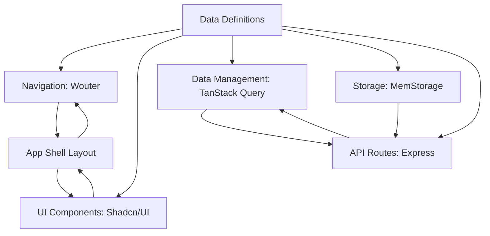

# LearnHub-Dashboard


**LearnHub-Dashboard** is a full-stack web application dashboard for managing and visualizing data in an online learning platform. It offers a seamless user experience with client-side navigation, reusable UI components, and efficient data fetching from robust backend APIs. Monitor courses, students, and teachers with a modern, responsive interface.

## Table of Contents

- [Overview](#overview)
- [Features](#features)
- [Tech Stack](#tech-stack)
- [Architecture](#architecture)
- [Installation](#installation)
- [Usage](#usage)
- [Contributing](#contributing)
- [License](#license)

## Overview

LearnHub-Dashboard streamlines the management of an online learning platform. Built with modern web technologies like React, TypeScript, and Express.js, it ensures a fast, scalable, and maintainable application. Shared data schemas provide consistency, and in-memory storage simplifies development, with PostgreSQL planned for production.

## Features

- 📊 **Dynamic Dashboard**: Visualize key metrics (e.g., teacher and student counts) with intuitive cards.
- 📚 **Course Management**: Browse and view detailed course information effortlessly.
- 🚀 **Smooth Navigation**: Client-side routing for fast, reload-free page transitions.
- ⚡ **Efficient Data Fetching**: TanStack Query optimizes data retrieval and caching.
- 🎨 **Consistent UI**: Reusable Shadcn/UI components for a polished, uniform look.
- 🛠️ **Developer-Friendly**: Hot Module Replacement and in-memory storage for rapid iteration.
- 🔧 **Scalable Design**: Shared schemas enable easy database integration.

## Tech Stack

- **Frontend**:
  - React v18
  - TypeScript v5
  - Shadcn/UI (customizable components)
  - TanStack Query (data fetching)
  - Wouter (client-side routing)
  - Tailwind CSS (styling)
  - Framer Motion (animations)

- **Backend**:
  - Express.js (API server)
  - Zod (data validation)
  - Drizzle ORM (schema definitions)

- **Build Tools**:
  - Vite (fast dev server and builds)
  - ESBuild (backend bundling)

- **Data Storage**:
  - In-Memory (MemStorage) for development
  - PostgreSQL (planned for production)

## Architecture

The application follows a modular, scalable design:



- **Data Definitions**: Zod and Drizzle ORM ensure consistent data structures.
- **Navigation**: Wouter enables smooth page transitions.
- **UI Components**: Shadcn/UI and custom components for cohesive UI.
- **Data Management**: TanStack Query for efficient data handling.
- **Storage**: MemStorage for quick development data.
- **API Routes**: Express.js endpoints for data communication.
- **App Shell Layout**: Persistent sidebar and header for consistent UX.

## Installation

1. **Clone the Repository**:
   ```bash
   git clone https://github.com/your-username/LearnHub-Dashboard.git
   cd LearnHub-Dashboard
   ```

2. **Install Dependencies**:
   ```bash
   npm install
   ```

3. **Run Development Server**:
   ```bash
   npm run dev
   ```
   Access at `http://localhost:5000` with live reloading via Vite.

4. **Build for Production**:
   ```bash
   npm run build
   ```
   Outputs optimized files to the `dist` folder.

5. **Start Production Server**:
   ```bash
   npm run start
   ```
   Serves the app from `dist`.

## Usage

- **Development**:
  - Run `npm run dev` for a live-reloading dev server.
  - Edit files in `client/src` for instant UI updates.
  - Test APIs (e.g., `/api/metrics`, `/api/courses`) with tools like Postman.

- **Data Management**:
  - `server/storage.ts` (MemStorage) seeds sample data for development.
  - Data validated via `shared/schema.ts` using Zod.

- **Production**:
  - Build with `npm run build` and deploy the `dist` folder.
  - Use `npm run start` for production serving.

## Contributing

Contributions are welcome! To contribute:

1. Fork the repository.
2. Create a feature branch:
   ```bash
   git checkout -b feature/your-feature
   ```
3. Commit changes:
   ```bash
   git commit -m "Add your feature"
   ```
4. Push to your branch:
   ```bash
   git push origin feature/your-feature
   ```
5. Open a Pull Request.

Ensure code adheres to TypeScript standards and includes tests where applicable.

## License

© 2025 GitHub, Inc. Licensed under the [MIT License](LICENSE).
